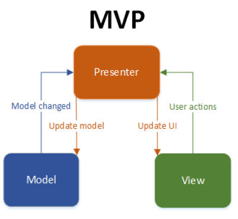
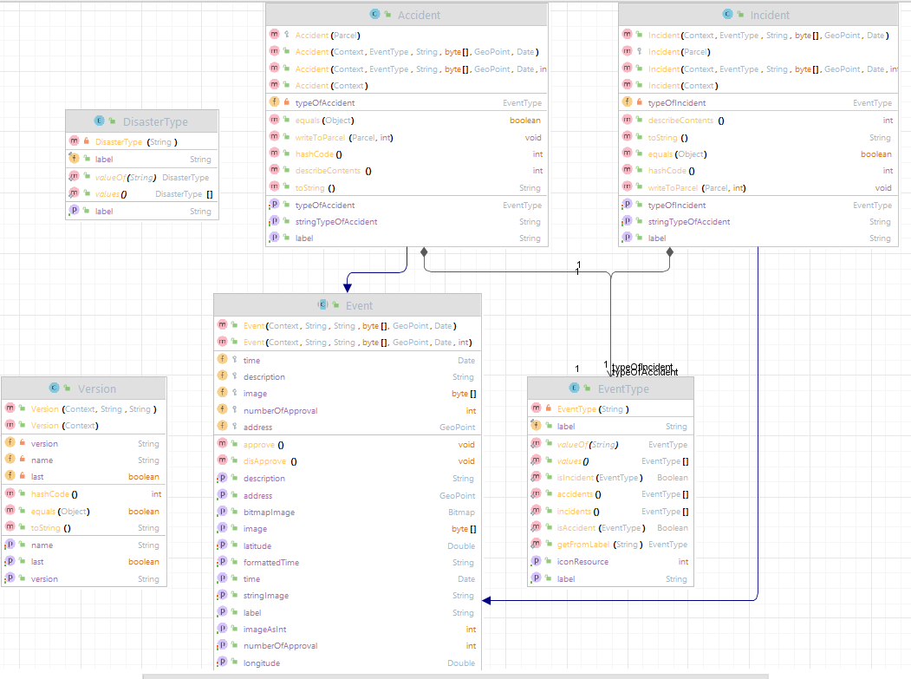

# Architecture

**Model - View - Presenter** type

This pattern is more suitable for our project, because the Model does not interact with View directly. Our interaction is:
* **Model**: Layer for storing data. It is responsible for handling the domain logic(real-world business rules) and communication with the database and network layers.
* **View**: UI(User Interface) layer. It provides the visualization of the data and keep a track of the user’s action in order to notify the Presenter.
* **Presenter**: Fetch the data from the model and applies the UI logic to decide what to display. It manages the state of the View and takes actions according to the user’s input notification from the View (OnClickListener, OnDateChangeListener etc).

## Model

---------

Model is divided for 3 blocks. The first part is shown with Class Diagram on the next Figure.

* **Event class**:
    * Represents a generic road event.
    * Is a FirebaseObject class.
    * Provides constructors for creating instances of events with different sets of parameters. `Factory pattern`
    * Includes annotations for Firebase integration. `Database`
* **Accident class**:
    * Represents Accident on the road.
    * Extends the Event class and is Parcelable. `Parcelable pattern`
    * Contains annotations (FieldFirebase, GetterFirebase, SetterFirebase) for Firebase integration. `Database`
* **Incident class**:
    * Represents a road incident.
    * Extends the Event class and is Parcelable. `Parcelable pattern`
    * Contains annotations for Firebase integration. `Database`
* **DisasterType enum**:
    * Represents the types of road disasters. (`ACCIDENT`, `INCIDENT`)
    * Provides a label field and a getter method to retrieve the label.
* **EventType enum**:
    * Represents the types of incidents and accidents.
    * Defines an getIconResource() method for getting the icon resource corresponding to an event type. `Resource control`
* **Version class**:
    * Represents the FirebaseObject class. `Database`
    * Contains annotations for Firebase integration. `Database`

The second part (`volley` package) is created for FireBase communication and integration.

The third part (`patterns` package) saves the helpers for the used patterns.

## View

---------
In our project we consider `layouts` in `res` folder as a view. So, this is standard UI.

## Presenter

---------
Project is the biggest part of our project. We divided presenter on sub folders:
* **archive**: contains presenters for the `Archive` View. Which lists all events created by current user. Implements `Adapter pattern` for the List.
* **form**: contains presenter for the `AddForm` View. Which allow users to create new / modify existing interfaces. Implements `Adapter pattern` for the Spinner.
* **home**: contains presenters for the `Home` View. Because it is quite big and central part of our project, it is divided on `activity` folder, which contains listeners for the activities on the View (LoadActivity, HomeActivity, AccidentInfoActivity) and `presenter` folder, which contains MapPresenter (implements `Observable pattern`), MarkersPresenter and SearchPresenter.
* **notification**: contains presenters for the `Notification` part. `Singleton pattern`
* **profile**: contains presenters for the `Profile` View. It creates the fragment `Dynamically`.
* **reusable**: contains presenters for repeating parts of the project (`NavbarFragment`, `AddButtonFragment` Views). Also it contains `OpenStreetMapAPI` class which allows to convert City name to Coordinates and opposite. These methods execute `asynchronously`.

## Proses of selected approach
Model-View-Presenter (MVP) pattern is a good choice for our application, because of (from documentation):
1. **Separation of Concerns**: MVP enforces a clear separation between the different components of an application. This separation allows for better code organization and maintainability. Each component has its own responsibilities, making it easier to understand, modify, and test the code.

2. **Testability**: MVP promotes testability by decoupling the business logic from the Android framework. The Presenter acts as a middleman between the View and the Model, handling user interactions and business logic. With this separation, unit testing becomes simpler as the Presenter can be tested independently of the Android framework, using mock objects for the View and Model.

3. **Scalability**: MVP provides a scalable architecture that can handle complex applications. By separating the concerns, it allows for easier modifications and additions to the codebase. New features or changes can be implemented in the Presenter without affecting the View or Model, which promotes code reuse and maintainability.

4. **Flexibility**: MVP allows for flexibility in UI design. The View layer can be implemented using different technologies or frameworks, such as Activities, Fragments, or custom views. The Presenter handles the interaction between the View and the Model, providing a level of abstraction that allows for changes in the UI without affecting the underlying business logic.

5. **Maintainable and Readable Code**: The separation of concerns in MVP leads to cleaner and more maintainable code. The responsibilities of each component are clearly defined, making the codebase easier to understand and navigate. This promotes collaboration among developers and simplifies the debugging and troubleshooting processes.
